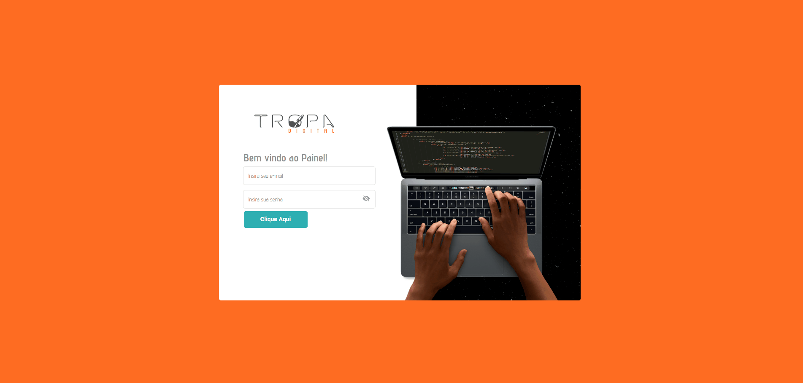

# Teste Tropa digital

## Resumo:

Foi utilizado o framework ReactJs para elabaoração do teste conforme solicitado.

Para desenvolvolvimento da aplicação foi utlizado:
* Hooks
*  React Router
* styled-components
* renderizações condicionais

## Interface
